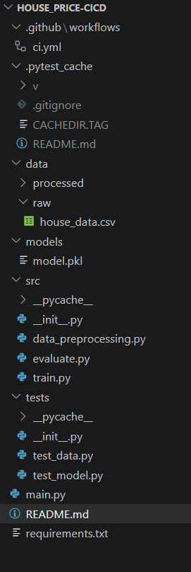
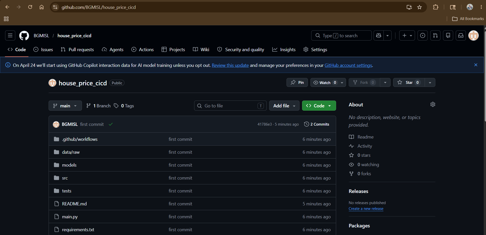
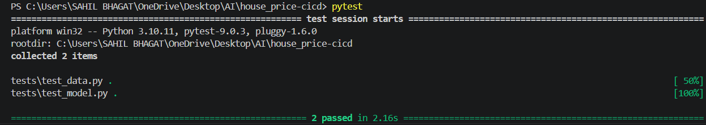
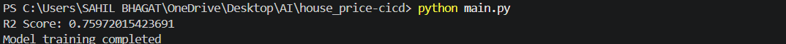

# House Price Prediction CI/CD

## Project Overview

This project predicts house prices using Linear Regression.

## Features

- Data preprocessing
- Model training
- Model evaluation
- Model saving
- CI/CD using GitHub Actions

## Technologies Used

- Python
- scikit-learn
- pandas
- pytest
- GitHub Actions

## Run Locally

```bash
pip install -r requirements.txt
python main.py

## Project Structure



---

## GitHub Repository



---

## Pytest Output



---

## Model Output

